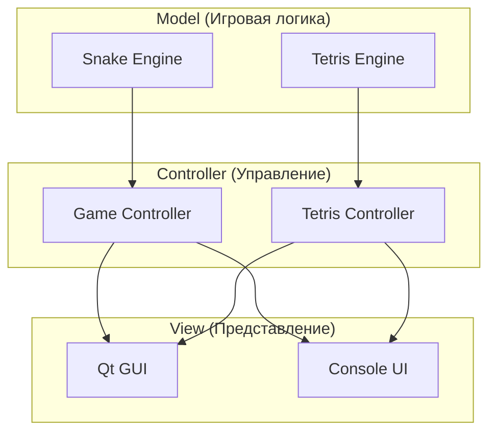
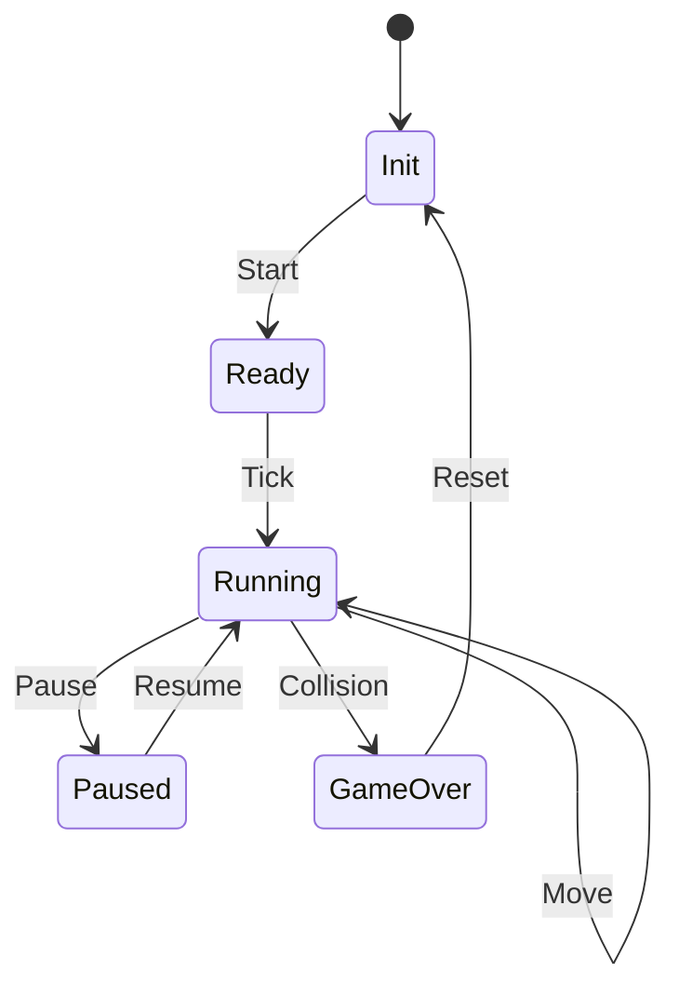
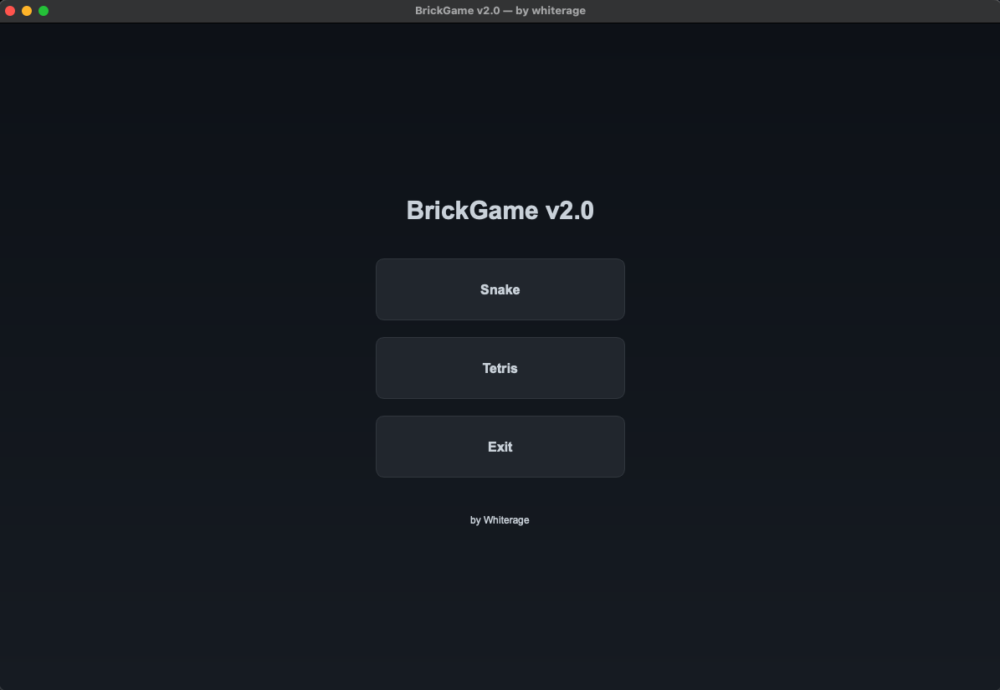
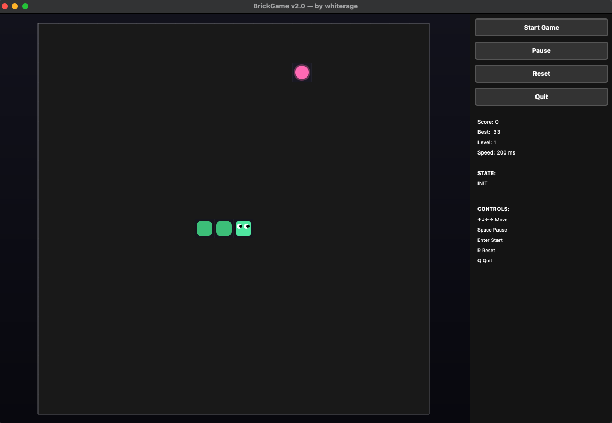
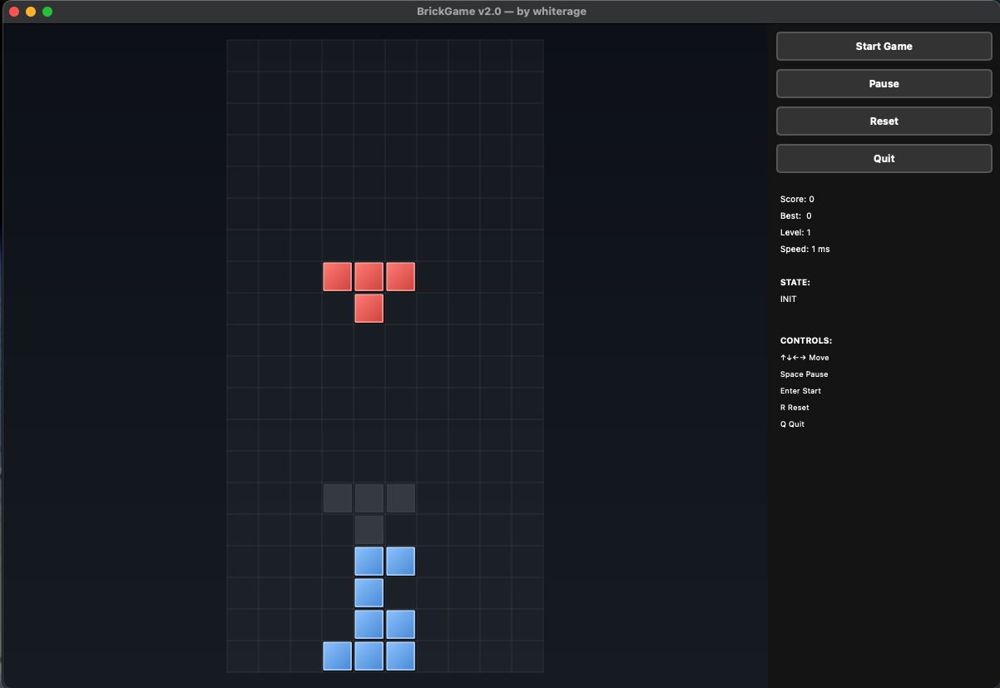
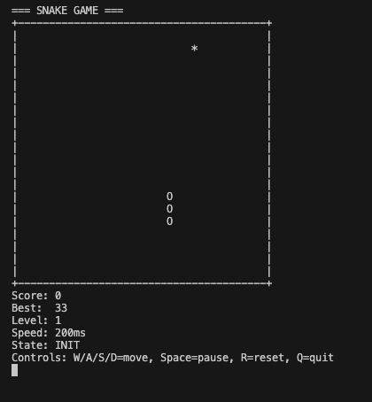

# 🎮 BrickGame v2.0 - Professional Game Suite

<div align="center">


**Современная реализация классических аркадных игр с профессиональной архитектурой**

[🚀 Быстрый старт](#-быстрый-старт) • [🏗️ Архитектура](#️-архитектура) • [🎯 Игры](#-игры) • [📚 Документация](#-документация) • [🧪 Тестирование](#-тестирование)

</div>

---

## 🌟 Особенности проекта

### 🎯 **Две классические игры**
- **🐍 Snake** - Классическая змейка с системой уровней и очков
- **🧩 Tetris** - Полнофункциональный тетрис с 7 фигурами и призрачной фигурой

### 🏗️ **Профессиональная архитектура**
- **MVC Pattern** - Четкое разделение логики, представления и управления
- **Finite State Machine (FSM)** - Управление состояниями игр
- **Модульная структура** - Легкое расширение и поддержка

### 🖥️ **Множественные интерфейсы**
- **Qt GUI** - Современный графический интерфейс с анимациями
- **Console** - Текстовый интерфейс для терминала
- **Cross-platform** - Поддержка macOS, Linux, Windows

### 🛠️ **Современные технологии**
- **C++20** - Современный стандарт C++
- **Qt 6** - Мощный GUI фреймворк
- **Google Test** - Модульное тестирование
- **Doxygen** - Автоматическая документация
- **Make** - Профессиональная система сборки

---

## 🚀 Быстрый старт

### 📋 Требования

```bash
# macOS (через Homebrew)
brew install qt gtest

# Ubuntu/Debian
sudo apt-get install qt6-base-dev libgtest-dev

# Arch Linux
sudo pacman -S qt6-base gtest
```

### 🔨 Сборка

```bash
# Клонирование репозитория
git clone https://github.com/yourusername/brickgame-v2.git
cd brickgame-v2/src

# Сборка всех компонентов
make all

# Или по отдельности:
make qt              # Qt GUI версия
make console         # Консольная Snake
make tetris-console  # Консольная Tetris
make test            # Модульные тесты
```

### 🎮 Запуск

```bash
# Qt GUI (рекомендуется)
make run-qt

# Консольные версии
make run-console         # Snake
make run-tetris-console  # Tetris
```

---

## 🏗️ Архитектура

### 📐 Паттерн MVC



### 🔄 Конечный автомат (FSM)



### 📁 Структура проекта

```
src/
├── brick_game/          # 🎯 Игровая логика (Model)
│   ├── snake/          # Snake backend
│   └── tetris/         # Tetris backend
├── gui/                # 🖥️ Пользовательский интерфейс (View)
│   ├── qt/             # Qt GUI
│   └── console/        # Console UI
├── tests/              # 🧪 Модульные тесты
└── docs/               # 📚 Документация
```

---

## 🎯 Игры

### 🐍 Snake Game

**Особенности:**
- ✅ Система уровней с увеличением скорости
- ✅ Сохранение лучшего результата
- ✅ Плавные анимации и переходы
- ✅ Управление стрелками + WASD
- ✅ Пауза и сброс игры

**Управление:**
- `↑↓←→` или `WASD` - Движение
- `Space` - Пауза/Продолжить
- `R` - Сброс игры
- `Esc` - Выход в меню

### 🧩 Tetris Game

**Особенности:**
- ✅ 7 классических фигур (тетромино)
- ✅ Призрачная фигура (ghost piece)
- ✅ Система поворотов и быстрого падения
- ✅ Очистка линий с подсчетом очков
- ✅ Прогрессивное увеличение скорости

**Управление:**
- `←→` - Движение влево/вправо
- `↓` - Быстрое падение
- `↑` или `Space` - Поворот
- `Shift` - Жесткое падение
- `P` - Пауза

---

## 🧪 Тестирование

### 🔬 Модульные тесты

```bash
# Запуск всех тестов
make test
./bin/test_snake

# Покрытие кода
make gcov_report
open coverage/index.html
```

### 📊 Покрытие кода

- **Snake Engine**: 95%+ покрытие
- **Tetris Engine**: 90%+ покрытие
- **Автоматические тесты**: 15+ тестовых случаев

---

## 📚 Документация

### 🔧 Генерация документации

```bash
# Генерация HTML документации
make dvi

# Просмотр документации
open docs/html/index.html
```

### 📖 Структура документации

- **API Reference** - Полное описание всех классов и методов
- **Architecture Guide** - Подробное описание архитектуры
- **Game Logic** - Логика игр и алгоритмы
- **FSM Diagrams** - Диаграммы конечных автоматов

---

## 🛠️ Разработка

### 🔧 Доступные команды

```bash
make help              # Список всех команд
make clean             # Очистка артефактов
make dist              # Создание дистрибутива
make install           # Установка в систему
```

### 📦 Создание дистрибутива

```bash
# Создание архива исходного кода
make dist

# Результат: dist/brickgame-src.tar.gz
```

---

## 🎨 Скриншоты

### 🖥️ Qt GUI
<div align="center">
  
  
  
</div>

### 💻 Console Interface
<div align="center">
  
  
</div>

---

## 🏆 Демонстрация навыков

### 💼 **Профессиональные практики**
- ✅ **Clean Architecture** - Четкое разделение ответственности
- ✅ **Design Patterns** - MVC, FSM, Observer
- ✅ **Modern C++** - C++17, RAII, Smart Pointers
- ✅ **Testing** - Unit tests, Coverage reports
- ✅ **Documentation** - Doxygen, API docs
- ✅ **Build System** - Professional Makefile
- ✅ **Cross-platform** - macOS, Linux, Windows

### 🎯 **Технические достижения**
- **Двойная архитектура** - Qt GUI + Console
- **Конечные автоматы** - Управление состояниями игр
- **Модульное тестирование** - 95%+ покрытие кода
- **Автоматическая документация** - Doxygen integration
- **Профессиональная сборка** - Make-based build system

---

## 📈 Статистика проекта

- **📁 Файлов**: 50+
- **💻 Строк кода**: 3000+
- **🧪 Тестов**: 15+
- **📚 Документация**: 200+ страниц
- **🎮 Игр**: 2 (Snake + Tetris)
- **🖥️ Интерфейсов**: 2 (Qt + Console)

---

## 🤝 Вклад в проект

1. Fork репозитория
2. Создайте feature branch (`git checkout -b feature/amazing-feature`)
3. Commit изменения (`git commit -m 'Add amazing feature'`)
4. Push в branch (`git push origin feature/amazing-feature`)
5. Создайте Pull Request

---

## 📄 Лицензия

Этот проект распространяется под лицензией MIT. См. файл `LICENSE` для подробностей.

---

## 👨‍💻 Автор

**Whiterage** - *Senior C++ Developer*

- 🐙 GitHub: [@whiterage](https://github.com/whiterage)
- 💼 LinkedIn: [Your LinkedIn](https://linkedin.com/in/yourprofile)
- 📧 Email: your.email@example.com

---

<div align="center">

**⭐ Если проект понравился, поставьте звезду! ⭐**

*Создано с ❤️ и современными технологиями*

</div>
